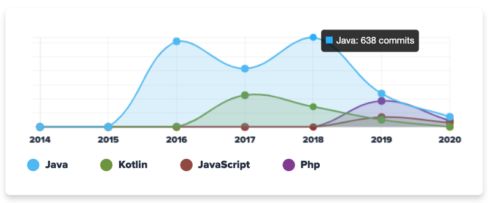

  

### Hi there 👋
I'm Marat Mingazov - Java Software Engineer, working on cool opensource tools.

  

### My projects:
1. [candyjar.io](https://candyjar.io) - Talent Acquisition Tool that helps you to search for developers by source code assessment on GitHub and deep searching on LinkedIn. CandyJar Engine continuously inspects developers' workflow to detect their experience, languages, stack of technologies.
2. [getCountry](https://github.com/MaratMingazovOrg/getCountry) - The simple Kotlin library that transforms String location into Country/Region/City
3. [EntityLocker](https://github.com/MaratMingazov/EntityLocker) - Demonstration of the multithreading mechanism in Java. EntityLocker is a reusable utility class that provides synchronization mechanism similar to row-level DB locking.
4. [CMemvit](https://github.com/MaratMingazov/CMemvit) - Eclipse Plugin C/C++ memory visualization tool, integrated into Eclipse IDE for C/C++ developers. CMemvit is based on idea of natural representation of process memory state. The key advantage of CMemvit from the visualization perspective is an opportunity to show stack and heap process memory areas with the maximum level of detail. This means that every element becomes visualized with specifying of its address in memory if it is technically possible.

### Get in touch
1. If you want to a short call with me - [calendly](https://calendly.com/maratmingazovr/call-with-marat-mingazov) 
2. Check my candyjar profile - https://candyjar.io/p/MaratMingazov
3. Check my linkedin profile - https://www.linkedin.com/in/maratmingazovr/
4. Write me on telegram - @MaratMingazovR

See you :)

